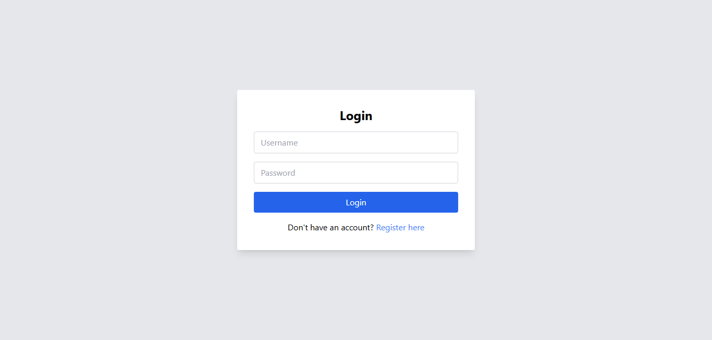
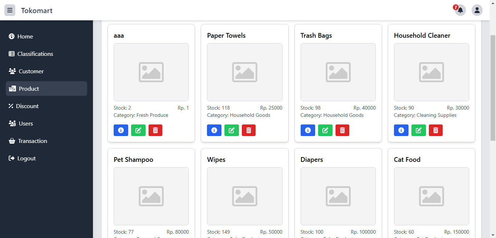
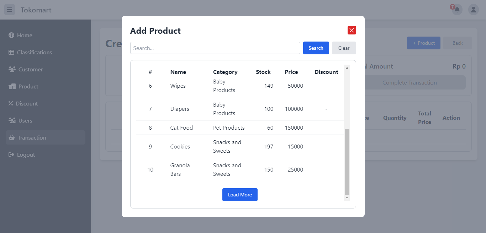
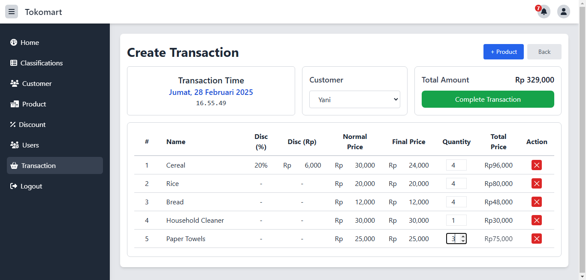
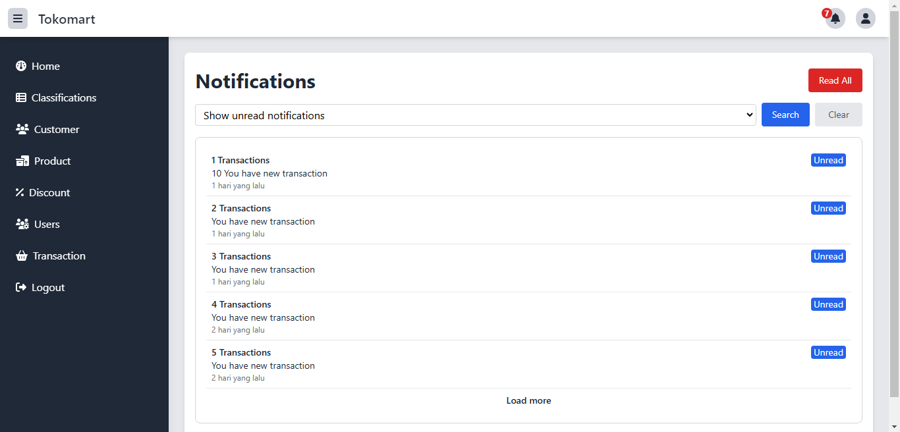

#  🛍️ Tokomart Frontend

Frontend Tokomart adalah aplikasi web yang dibangun menggunakan ReactJS untuk menyediakan antarmuka pengguna yang interaktif dan responsif untuk sistem e-commerce Tokomart.

## 🚀 Fitur

* **Manajemen Produk**: Menampilkan daftar produk, menambah, mengedit, dan menghapus produk.
* **Manajemen Pelanggan**: Menampilkan daftar pelanggan, menambah, mengedit, dan menghapus pelanggan.
* **Manajemen Diskon**: Menampilkan daftar diskon, menambah, mengedit, dan menghapus diskon.
* **Transaksi**: Melakukan transaksi penjualan dengan mudah.
* **Notifikasi**: Menampilkan notifikasi real-time.

## ️🛠️ Teknologi yang Digunakan

* **ReactJS**: Kerangka kerja JavaScript untuk membangun antarmuka pengguna.
* **React Router**: Navigasi antar halaman.
* **Axios**: HTTP client untuk berinteraksi dengan backend API.
* **Tailwind CSS**: Kerangka kerja CSS untuk styling.

## ️📷 Screenshot

### Login

### Daftar Produk

### Add Product Transaction

### Create Transaction

### All Notification

---
